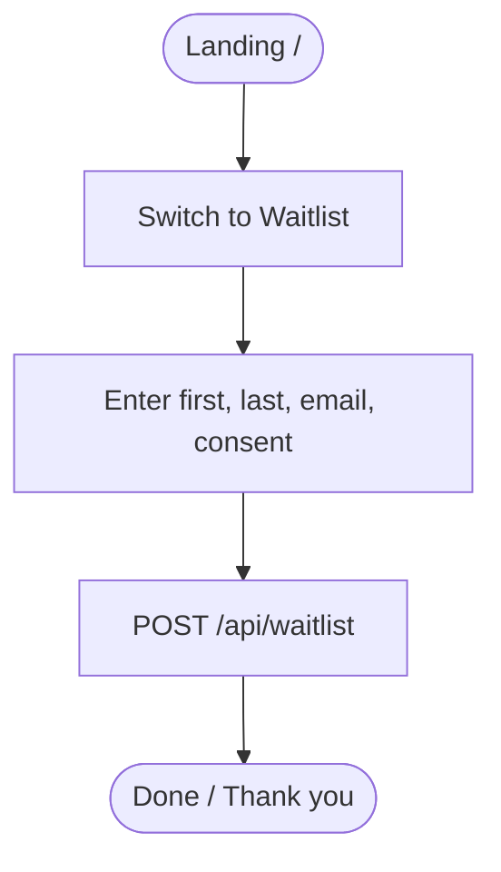

## Kinkly – User Flows (Concise Sketch)

Purpose: Quick, structured overview you can import/recreate in a diagramming tool.

### Legend
- Start/End: rounded
- Decision: diamond
- Data store: cylinder
- Important params: `elitePasscode`, `email`, `verified`

---

### 1) Pre‑Landing – With Elite Passcode
Steps:
1. User lands on `/` (pre‑landing)
2. Enters `elitePasscode`
3. Validate via `/api/auth/validate-code`
4. Show capture modal (required: first name, last name, email, consent)
5. Create prospect via `/api/prospects`
6. Trigger verification mail via `/api/auth/request-email-verification`
7. Store `kinklyVerificationPending=1` and `kinklyFormData`
8. Redirect to `/event?elitePasscode=...`

Mermaid (paste into tools that support Mermaid):


---

### 2) Pre‑Landing – No Code (Waitlist)
Steps:
1. From `/` switch to Waitlist
2. Required: first name, last name, email, consent
3. Save via `/api/waitlist`
4. Optional: later invite or magic‑link login



---

### 3) Email Verification Flow (Double Opt‑In)
Steps:
1. Backend creates token in `email_verifications`
2. Email contains link to `/api/auth/verify-email?token=...&redirect=...`
3. On click: token validated → mark verified → redirect to `/event`


---

### 4) Event Page – Soft Gate
Behavior:
- If `kinklyVerificationPending=1`: show banner with email, actions: Resend, Login, Close.
- Browsing allowed; actions like Ticket/Profil weiter via Login/Magic‑Link.

```mermaid
flowchart TD
  A([/event]) --> B{localStorage pending?}
  B -- yes --> C[Show verification banner]
  B -- no --> D[No banner]
  C --> E[Resend verification]
  C --> F[Login (Magic Link)]
  C --> G[Dismiss]
```

---

### 5) Login via Magic Link
Steps:
1. Request link: `POST /api/auth/request-magic-link` (email, redirect)
2. Click link: `GET /api/auth/magic-login?token=...` → sets session cookie → redirect `/event`


---

### 6) Referral Code/Ticket Flow (Event‑Seite)
Steps:
1. User klickt „Request Ticket“ / wählt Tier
2. Referral Code Modal (falls nötig) → TicketForm
3. Submit Application `/api/applications` (resolves `elitePasscode` → `referral_code_id`)
4. Payment: Stripe/PayPal
5. On success: `payments` insert, `applications.status=pending_review`, decrement tier stock
6. Confirmation mail


---

### 7) Resend Verification (New Device or Missed Mail)
Options:
- Banner „Mail erneut senden“ → `POST /api/auth/request-email-verification`
- Kein Banner sichtbar: Login‑Button im Header oder kleiner Link „Verifizierungs‑Mail erneut senden“ (empfohlen)

---

### 8) Admin (Kurz)
- Login (separat)
- Dashboard: Users, Referral Codes, Scarcity, Waitlist
- Actions: Assign code to waitlist, send invite, adjust scarcity

---

## Tool‑Vorschläge (Online)
- Miro (Flowchart, Swimlanes, Mermaid Widget optional)
- Whimsical (schnelle User Flows/Wireflows)
- FigJam (Figma) – Teamfreundlich, Sticky‑notes + Shapes
- diagrams.net (draw.io) – kostenlos, Export nach SVG/PNG
- Mermaid Live Editor – für die Code‑Snippets oben (`https://mermaid.live`)

Tipps:
- Nutze Swimlanes: Frontend / Backend / Email
- Nutze eindeutige Statusnamen: `pending_verification`, `pending_review`, `approved`


